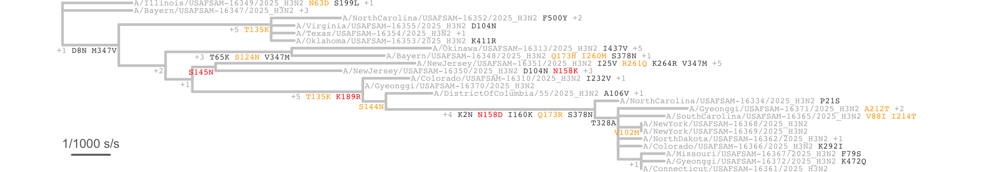
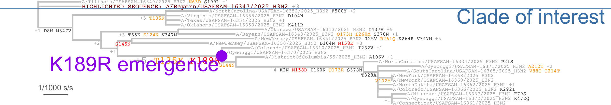

# mutationtree

[](https://github.com/SamT123/mutationtree/actions/workflows/R-CMD-check.yaml)

Plot phylogenetic trees annotated with amino acid and synonymous mutation annotations along branches.

## Installation

```r
# Install dependencies
devtools::install_github("SamT123/seqUtils")
devtools::install_github("SamT123/convergence")

# Install mutationtree
devtools::install_github("SamT123/mutationtree")
```

**System requirements:**

- [MAFFT](https://mafft.cbrc.jp/alignment/software/) for sequence alignment
- [cmaple](https://github.com/iqtree/cmaple) for phylogenetic tree building
- [UShER](https://github.com/yatisht/usher) for ancestral sequence reconstruction

## Relationship with convergence

`mutationtree` is a visualization layer built on top of [`convergence`](https://github.com/SamT123/convergence):

- **convergence** handles: tree building, ancestral sequence reconstruction, data structures
- **mutationtree** handles: plotting trees with mutation labels

## Quick Start

```r
library(mutationtree)

# Assuming you have a tree_and_sequences object from convergence
mutationtree::draw_mutation_tree(tree_and_sequences)
```

## Examples

### Basic Example

Complete workflow from FASTA sequences to annotated tree:

```r
library(tidyverse)
library(seqUtils)
library(convergence)
library(mutationtree)

# 1. Load and align sequences
aligned_sequences <- "sequences.fasta" %>%
  seqUtils::fast_fasta() %>%
  seqUtils::mafft_align(seqUtils::alaska_232_2015_nts)

# 2. Build phylogenetic tree
tree <- seqUtils::make_cmaple_tree(
  sequences = aligned_sequences,
  tree_path = "tree.nwk",
  cmaple_path = "/path/to/cmaple/bin/",
  out_sequence = "outgroup_name"
) %>%
  ape::ladderize()

# 3. Create tree_and_sequences object
tree_and_sequences <- convergence::makeTreeAndSequences(
  tree,
  tibble(
    Isolate_unique_identifier = names(aligned_sequences),
    dna_sequence = unname(aligned_sequences)
  )
)

# 4. Add ancestral sequence reconstruction
tree_with_asr <- convergence::addASRusher(
  tree_and_sequences,
  aa_ref = seqUtils::alaska_232_2015_aas,
  nuc_ref = seqUtils::alaska_232_2015_nts,
  usher_path = "/path/to/usher/bin/"
)

# 5. Draw the tree
mutationtree::draw_mutation_tree(
  tree_with_asr,
  file = "output.png"
)
```

See `inst/example/basic_example.R` for a complete working example with H3N2 influenza sequences.

**Output:**



### Customized Example

Add annotations using four key arguments:

```r
mutationtree::draw_mutation_tree(
  tree_with_asr,
  file = "annotated.png",

  # Add horizontal reference lines for clades
  lines = list(
    list(
      height = 20,
      text = "Clade label",
      line_color = "steelblue",
      text_color = "steelblue"
    )
  ),

  # Highlight specific tips
  modified_tip_labels = list(
    list(
      old_label = "original_name",
      new_label = "Highlighted: original_name",
      text_color = "darkred",
      text_cex = 0.3
    )
  ),

  # Emphasize mutations at nodes
  modified_node_labels = list(
    list(
      node = "123",
      text_cex = 0.4,
      text_color = "purple"
    )
  ),

  # Add extra labels with points
  additional_node_labels = list(
    list(
      node = 123,
      text = "Important node",
      text_color = "purple",
      point_color = "purple"
    )
  )
)
```

See `inst/example/customized_example.R` for a complete working example.

**Output:**



## Features

- **Mutation labels**: Non-synonymous (amino acid) mutations shown with position-specific colors
- **Synonymous counts**: Indicated as "+N" where N is the count
- **Flexible styling**: Control colors, sizes, and positions of all elements
- **Export formats**: PNG (600 dpi) or PDF
- **Reference lines**: Mark clades or time periods
- **Custom annotations**: Highlight specific nodes or tips

## Output

The function automatically sizes the output based on the number of sequences and creates a scale bar showing "1 mutation" for reference. Synonymous mutations are shown in grey, while non-synonymous mutations use customizable colors.
